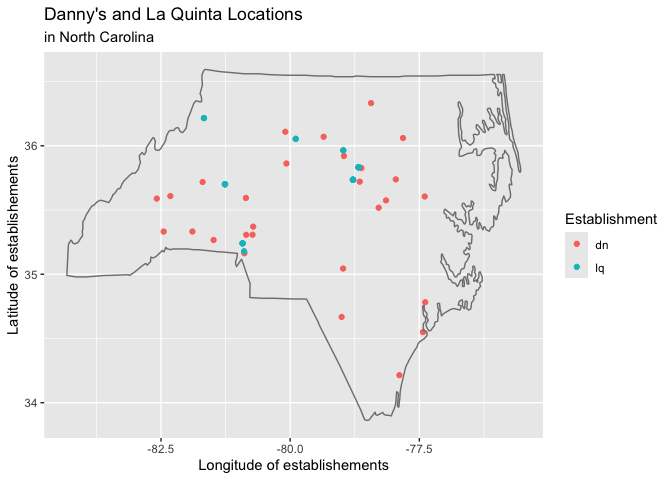
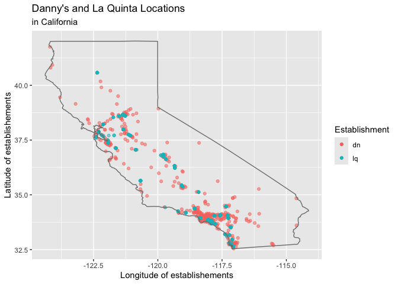

Lab 05 - La Quinta is Spanish for next to Denny’s, Pt. 2
================
Olivia Zhang
02/23/2025

### Load packages and data

``` r
library(tidyverse) 
library(dsbox) 
```

``` r
states <- read_csv("data/states.csv")
```

### Exercise 1

``` r
dn_ak <- dennys %>%
  filter(state == "AK")
nrow(dn_ak)
```

    ## [1] 3

There are 3 Denny’s locations in Alaska.

``` r
lq_ak <- laquinta %>%
  filter(state == "AK")
nrow(lq_ak)
```

    ## [1] 2

There are 2 La Quinta locations in Alaska.

### Exercise 2

``` r
dn_ak$establishment <- "dn"
lq_ak$establishment <- "lq"

dn_lq_ak1 <- 
  full_join(dn_ak, lq_ak, by = join_by(address, city, state, zip, longitude, latitude, establishment))
```

``` r
#dn1
dn1_lq1 <- sqrt((dn_lq_ak1$longitude[1] - dn_lq_ak1$longitude[4])^2 + (dn_lq_ak1$latitude[1] - dn_lq_ak1$latitude[4])^2)
dn1_lq2 <- sqrt((dn_lq_ak1$longitude[1] - dn_lq_ak1$longitude[5])^2 + (dn_lq_ak1$latitude[1] - dn_lq_ak1$latitude[5])^2)

#dn2
dn2_lq1 <- sqrt((dn_lq_ak1$longitude[2] - dn_lq_ak1$longitude[4])^2 + (dn_lq_ak1$latitude[2] - dn_lq_ak1$latitude[4])^2)
dn2_lq2 <- sqrt((dn_lq_ak1$longitude[2] - dn_lq_ak1$longitude[5])^2 + (dn_lq_ak1$latitude[2] - dn_lq_ak1$latitude[5])^2)

#dn3
dn3_lq1 <- sqrt((dn_lq_ak1$longitude[3] - dn_lq_ak1$longitude[4])^2 + (dn_lq_ak1$latitude[3] - dn_lq_ak1$latitude[4])^2)
dn3_lq2 <- sqrt((dn_lq_ak1$longitude[3] - dn_lq_ak1$longitude[5])^2 + (dn_lq_ak1$latitude[3] - dn_lq_ak1$latitude[5])^2)
```

There are six pairings.

### Exercise 3

Well, I guess I did in my own way above. I’ll follow the steps now.

``` r
dn_lq_ak <- full_join(dn_ak, lq_ak, 
                      by = "state")
```

    ## Warning in full_join(dn_ak, lq_ak, by = "state"): Detected an unexpected many-to-many relationship between `x` and `y`.
    ## ℹ Row 1 of `x` matches multiple rows in `y`.
    ## ℹ Row 1 of `y` matches multiple rows in `x`.
    ## ℹ If a many-to-many relationship is expected, set `relationship =
    ##   "many-to-many"` to silence this warning.

``` r
dn_lq_ak
```

    ## # A tibble: 6 × 13
    ##   address.x  city.x state zip.x longitude.x latitude.x establishment.x address.y
    ##   <chr>      <chr>  <chr> <chr>       <dbl>      <dbl> <chr>           <chr>    
    ## 1 2900 Dena… Ancho… AK    99503       -150.       61.2 dn              3501 Min…
    ## 2 2900 Dena… Ancho… AK    99503       -150.       61.2 dn              4920 Dal…
    ## 3 3850 Deba… Ancho… AK    99508       -150.       61.2 dn              3501 Min…
    ## 4 3850 Deba… Ancho… AK    99508       -150.       61.2 dn              4920 Dal…
    ## 5 1929 Airp… Fairb… AK    99701       -148.       64.8 dn              3501 Min…
    ## 6 1929 Airp… Fairb… AK    99701       -148.       64.8 dn              4920 Dal…
    ## # ℹ 5 more variables: city.y <chr>, zip.y <chr>, longitude.y <dbl>,
    ## #   latitude.y <dbl>, establishment.y <chr>

### Exercise 4

There are 6 observations in the joined dn_lq_ak data frame. The names
are address.x, city.x, state, zip.x, longitude.x, latitude.x,
establishment.x, address.y, city.y, zip.y, longitude.y, latitude.y,
establishment.y.

### Exercise 5

### Exercise 6

``` r
dn_lq_ak$distance <- haversine(dn_lq_ak$longitude.x, dn_lq_ak$latitude.x, dn_lq_ak$longitude.y, dn_lq_ak$latitude.y, round = 3)
```

### Exercise 7

``` r
dn_lq_ak_mindist <- dn_lq_ak %>%
  group_by(address.x) %>%
  summarize(closest = min(distance))
```

### Exercise 8

``` r
dn_lq_ak %>%
  filter(dn_lq_ak$distance %in% dn_lq_ak_mindist$closest) %>%
  ggplot() +
  geom_point(mapping = aes(
    x = longitude.x,
    y = latitude.x,
    color = establishment.x
    )) +
  geom_point(mapping = aes(
    x = longitude.y,
    y = latitude.y,
    color = establishment.y
    )) +
  labs(
  title = "Danny's and La Quinta Locations",
  subtitle = "in Alaska",
  x = "Longitude of establishements", 
  y = "Latitude of establishements", 
  color = "Establishment"
     )
```

<!-- -->

As shown in the graph, in Alaska, La Quinta locations are all near
Denny’s. The distance between the nearest Denny’s and La Quinta are
5.197, 2.035, 5.998.

### Exercise 9

``` r
#filter out NC
dn_nc <- dennys %>%
  filter(state == "NC")

lq_nc <- laquinta %>%
  filter(state == "NC")

#join the data frames
dn_nc$establishment <- "dn"
lq_nc$establishment <- "lq"

dn_lq_nc <- full_join(dn_nc, lq_nc, 
                      by = "state")
```

    ## Warning in full_join(dn_nc, lq_nc, by = "state"): Detected an unexpected many-to-many relationship between `x` and `y`.
    ## ℹ Row 1 of `x` matches multiple rows in `y`.
    ## ℹ Row 1 of `y` matches multiple rows in `x`.
    ## ℹ If a many-to-many relationship is expected, set `relationship =
    ##   "many-to-many"` to silence this warning.

``` r
dn_lq_nc
```

    ## # A tibble: 336 × 13
    ##    address.x city.x state zip.x longitude.x latitude.x establishment.x address.y
    ##    <chr>     <chr>  <chr> <chr>       <dbl>      <dbl> <chr>           <chr>    
    ##  1 1 Regent… Ashev… NC    28806       -82.6       35.6 dn              165 Hwy …
    ##  2 1 Regent… Ashev… NC    28806       -82.6       35.6 dn              3127 Slo…
    ##  3 1 Regent… Ashev… NC    28806       -82.6       35.6 dn              4900 Sou…
    ##  4 1 Regent… Ashev… NC    28806       -82.6       35.6 dn              4414 Dur…
    ##  5 1 Regent… Ashev… NC    28806       -82.6       35.6 dn              1910 Wes…
    ##  6 1 Regent… Ashev… NC    28806       -82.6       35.6 dn              1201 Lan…
    ##  7 1 Regent… Ashev… NC    28806       -82.6       35.6 dn              1607 Fai…
    ##  8 1 Regent… Ashev… NC    28806       -82.6       35.6 dn              191 Cres…
    ##  9 1 Regent… Ashev… NC    28806       -82.6       35.6 dn              2211 Sum…
    ## 10 1 Regent… Ashev… NC    28806       -82.6       35.6 dn              1001 Aer…
    ## # ℹ 326 more rows
    ## # ℹ 5 more variables: city.y <chr>, zip.y <chr>, longitude.y <dbl>,
    ## #   latitude.y <dbl>, establishment.y <chr>

``` r
#calculate distances for all pairings 
dn_lq_nc$distance <- haversine(dn_lq_nc$longitude.x, dn_lq_nc$latitude.x, dn_lq_nc$longitude.y, dn_lq_nc$latitude.y, round = 3)

#find the minimum distance
dn_lq_nc_mindist <- dn_lq_nc %>%
  group_by(address.x) %>%
  summarize(closest = min(distance))

#visualize the shortest distances
dn_lq_nc %>%
  filter(dn_lq_nc$distance %in% dn_lq_nc_mindist$closest) %>%
  ggplot() +
  geom_point(mapping = aes(
    x = longitude.x,
    y = latitude.x,
    color = establishment.x
    )) +
  geom_point(mapping = aes(
    x = longitude.y,
    y = latitude.y,
    color = establishment.y
    )) +
  labs(
  title = "Danny's and La Quinta Locations",
  subtitle = "in North Carolina",
  x = "Longitude of establishements", 
  y = "Latitude of establishements", 
  color = "Establishment"
     )
```

<!-- -->

### Exercise 10

``` r
#filter out TX
dn_tx <- dennys %>%
  filter(state == "TX")

lq_tx <- laquinta %>%
  filter(state == "TX")

#join the data frames
dn_tx$establishment <- "dn"
lq_tx$establishment <- "lq"

dn_lq_tx <- full_join(dn_tx, lq_tx, 
                      by = "state")
```

    ## Warning in full_join(dn_tx, lq_tx, by = "state"): Detected an unexpected many-to-many relationship between `x` and `y`.
    ## ℹ Row 1 of `x` matches multiple rows in `y`.
    ## ℹ Row 1 of `y` matches multiple rows in `x`.
    ## ℹ If a many-to-many relationship is expected, set `relationship =
    ##   "many-to-many"` to silence this warning.

``` r
dn_lq_tx
```

    ## # A tibble: 47,400 × 13
    ##    address.x city.x state zip.x longitude.x latitude.x establishment.x address.y
    ##    <chr>     <chr>  <chr> <chr>       <dbl>      <dbl> <chr>           <chr>    
    ##  1 120 East… Abile… TX    79601       -99.6       32.4 dn              3018 Cat…
    ##  2 120 East… Abile… TX    79601       -99.6       32.4 dn              3501 Wes…
    ##  3 120 East… Abile… TX    79601       -99.6       32.4 dn              14925 La…
    ##  4 120 East… Abile… TX    79601       -99.6       32.4 dn              909 East…
    ##  5 120 East… Abile… TX    79601       -99.6       32.4 dn              2400 Eas…
    ##  6 120 East… Abile… TX    79601       -99.6       32.4 dn              1220 Nor…
    ##  7 120 East… Abile… TX    79601       -99.6       32.4 dn              1165 Hwy…
    ##  8 120 East… Abile… TX    79601       -99.6       32.4 dn              880 Sout…
    ##  9 120 East… Abile… TX    79601       -99.6       32.4 dn              1708 Int…
    ## 10 120 East… Abile… TX    79601       -99.6       32.4 dn              9305 Eas…
    ## # ℹ 47,390 more rows
    ## # ℹ 5 more variables: city.y <chr>, zip.y <chr>, longitude.y <dbl>,
    ## #   latitude.y <dbl>, establishment.y <chr>

``` r
#calculate distances for all pairings 
dn_lq_tx$distance <- haversine(dn_lq_tx$longitude.x, dn_lq_tx$latitude.x, dn_lq_tx$longitude.y, dn_lq_tx$latitude.y, round = 3)

#find the minimum distance
dn_lq_tx_mindist <- dn_lq_tx %>%
  group_by(address.x) %>%
  summarize(closest = min(distance))

#visualize the shortest distances
dn_lq_tx %>%
  filter(dn_lq_tx$distance %in% dn_lq_tx_mindist$closest) %>%
  ggplot() +
  geom_point(mapping = aes(
    x = longitude.x,
    y = latitude.x,
    color = establishment.x, 
    alpha = .5
    )) +
  geom_point(mapping = aes(
    x = longitude.y,
    y = latitude.y,
    color = establishment.y, 
    alpha = .5
    )) +
  labs(
  title = "Danny's and La Quinta Locations",
  subtitle = "in Texas",
  x = "Longitude of establishements", 
  y = "Latitude of establishements", 
  color = "Establishment"
     ) +
  guides(alpha = FALSE)
```

    ## Warning: The `<scale>` argument of `guides()` cannot be `FALSE`. Use "none" instead as
    ## of ggplot2 3.3.4.
    ## This warning is displayed once every 8 hours.
    ## Call `lifecycle::last_lifecycle_warnings()` to see where this warning was
    ## generated.

<!-- -->

### Exercise 11

``` r
#filter out CA
dn_ca <- dennys %>%
  filter(state == "CA")

lq_ca <- laquinta %>%
  filter(state == "CA")

#join the data frames
dn_ca$establishment <- "dn"
lq_ca$establishment <- "lq"

dn_lq_ca <- full_join(dn_ca, lq_ca, 
                      by = "state")
```

    ## Warning in full_join(dn_ca, lq_ca, by = "state"): Detected an unexpected many-to-many relationship between `x` and `y`.
    ## ℹ Row 1 of `x` matches multiple rows in `y`.
    ## ℹ Row 1 of `y` matches multiple rows in `x`.
    ## ℹ If a many-to-many relationship is expected, set `relationship =
    ##   "many-to-many"` to silence this warning.

``` r
dn_lq_ca
```

    ## # A tibble: 22,568 × 13
    ##    address.x city.x state zip.x longitude.x latitude.x establishment.x address.y
    ##    <chr>     <chr>  <chr> <chr>       <dbl>      <dbl> <chr>           <chr>    
    ##  1 14240 Us… Adela… CA    92301       -117.       34.5 dn              1752 Cle…
    ##  2 14240 Us… Adela… CA    92301       -117.       34.5 dn              8858 Spe…
    ##  3 14240 Us… Adela… CA    92301       -117.       34.5 dn              3232 Riv…
    ##  4 14240 Us… Adela… CA    92301       -117.       34.5 dn              920 Univ…
    ##  5 14240 Us… Adela… CA    92301       -117.       34.5 dn              3 Center…
    ##  6 14240 Us… Adela… CA    92301       -117.       34.5 dn              1771 Res…
    ##  7 14240 Us… Adela… CA    92301       -117.       34.5 dn              6275 Dub…
    ##  8 14240 Us… Adela… CA    92301       -117.       34.5 dn              316 Pitt…
    ##  9 14240 Us… Adela… CA    92301       -117.       34.5 dn              190 N. 1…
    ## 10 14240 Us… Adela… CA    92301       -117.       34.5 dn              46200 La…
    ## # ℹ 22,558 more rows
    ## # ℹ 5 more variables: city.y <chr>, zip.y <chr>, longitude.y <dbl>,
    ## #   latitude.y <dbl>, establishment.y <chr>

``` r
#calculate distances for all pairings 
dn_lq_ca$distance <- haversine(dn_lq_ca$longitude.x, dn_lq_ca$latitude.x, dn_lq_ca$longitude.y, dn_lq_ca$latitude.y, round = 3)

#find the minimum distance
dn_lq_ca_mindist <- dn_lq_ca %>%
  group_by(address.x) %>%
  summarize(closest = min(distance))

#visualize the shortest distances
dn_lq_ca %>%
  filter(dn_lq_ca$distance %in% dn_lq_ca_mindist$closest) %>%
  ggplot() +
  geom_point(mapping = aes(
    x = longitude.x,
    y = latitude.x,
    color = establishment.x,
    alpha = .5
    )) +
  geom_point(mapping = aes(
    x = longitude.y,
    y = latitude.y,
    color = establishment.y,
    alpha = .5
    )) +
  labs(
  title = "Danny's and La Quinta Locations",
  subtitle = "in California",
  x = "Longitude of establishements", 
  y = "Latitude of establishements", 
  color = "Establishment"
     ) +
  guides(alpha = FALSE)
```

<!-- -->

### Exercise 12

Mitch Hedberg’s joke about La Quinta is the Spanish for next for Denny’s
is true for most states except for North Carolina, where there are two
La Quinta’s that is still pretty far from the nearest Denny’s. It is
worth noting that it is generally true that if you find a La Quinta
location, there is a Denny’s near it, but this joke doesn’t garantee
that if you find a Denny’s location, a La Quinta’s location is
necessarily nearby.
